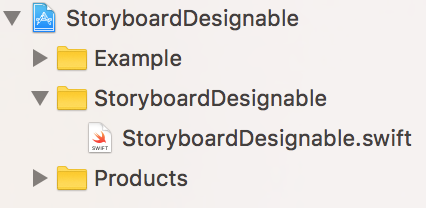
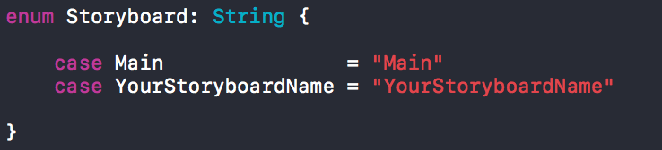

# StoryboardDesignable
Easy way to instantiate ViewController from Storyboard.

## Requirements
* Swift 3.0
* Xcode 8
* iOS 8+

## Setup

* Copy **StoryboardDesignable.swift** to your Xcode Project.



* Add your Storyboards name Enum in **StoryboardDesignable.swift**.



## Note

Set your ViewController's **Storyboard ID** is same the **Class Name**.


## Usage

Just instantiate by ViewController instantiate function!

Example:

```
let vc = YourViewController.instantiate(from: .StoryboardName)
self.navigationController?.pushViewController(vc, animated: true)
```

## Author

StoryboardDesignable, <fu6gjp4@gmail.com>.

